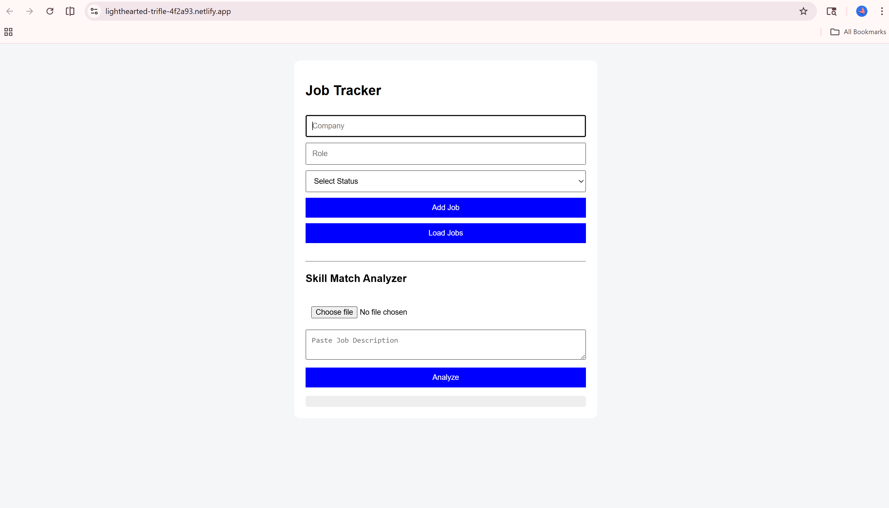
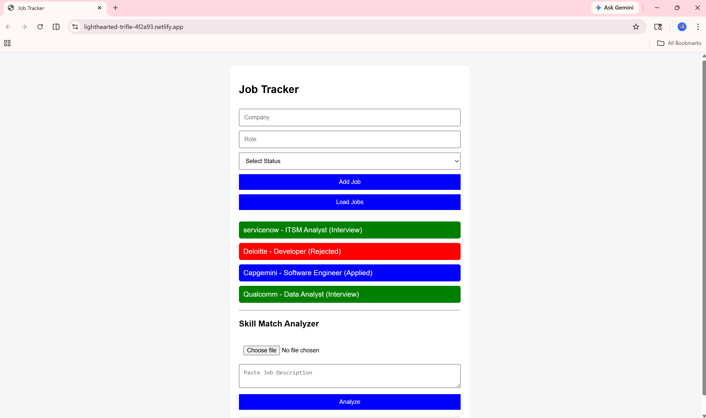
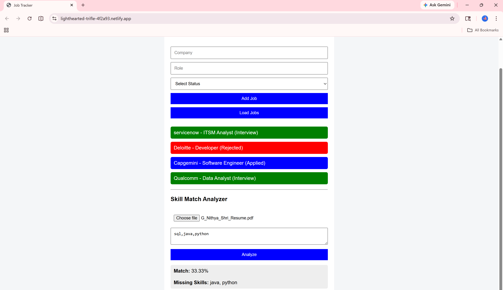
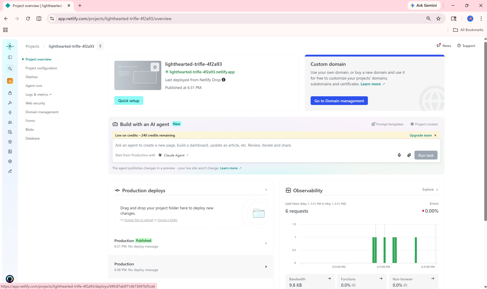

# 🚀 Job Tracker AI (Full Stack Project)

A full-stack web application to track job applications and analyze resumes using Flask backend and HTML/CSS/JavaScript frontend.

---

# 🔗 Live Demo

- 🌐 Frontend: https://lighthearted-trifle-4f2a93.netlify.app/
- 🖥 Backend: https://nithya5.pythonanywhere.com  

---

# 📌 Features

- Add job applications (Company, Role, Status)
- Track job status (Applied / Interview / Rejected)
- View all job applications dynamically
- Resume skill analyzer
- Match percentage calculation
- Missing skills detection
- REST API integration
- Fully deployed frontend + backend

---

# 🛠 Tech Stack

- Frontend: HTML, CSS, JavaScript
- Backend: Python, Flask
- Database: SQLite
- Deployment: Netlify + PythonAnywhere

---

# 📡 API Endpoints

- POST `/add-job` → Add job
- GET `/get-jobs` → Get all jobs
- POST `/analyze` → Resume analysis

---

# 📸 Screenshots

## 🏠 Home Page
  

---

## 📋 Job List View
  

---

## 📊 Resume Analyzer Output
  

---

## 🌍 Deployment
  

---

# 🧠 How It Works

1. User adds job details → stored in SQLite via Flask API  
2. User clicks Load Jobs → data fetched from backend  
3. User uploads resume → backend analyzes skills vs job description  
4. Result shown as match percentage + missing skills  

---

# 👨‍💻 Project Architecture

Frontend (HTML/JS) → API Calls → Flask Backend → SQLite DB

---

# 🚀 Future Improvements

- User authentication (Login/Signup)
- Dashboard analytics (charts)
- Resume scoring improvement using NLP
- Cloud database (PostgreSQL)
- UI upgrade (React frontend)

---

# 👨‍🎓 Author

Nithya Shri  
Full Stack Developer (Fresher)
